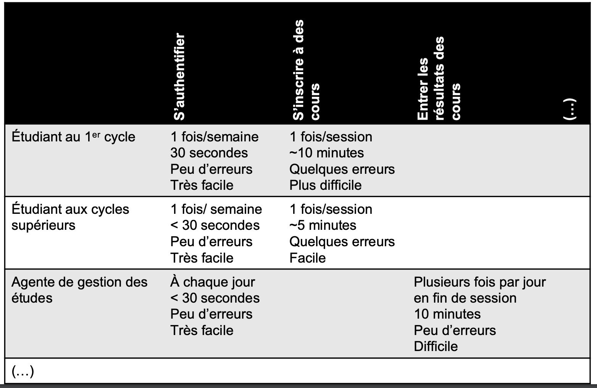
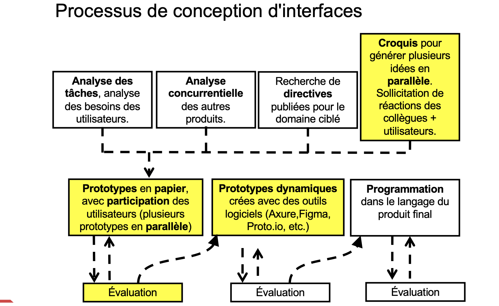
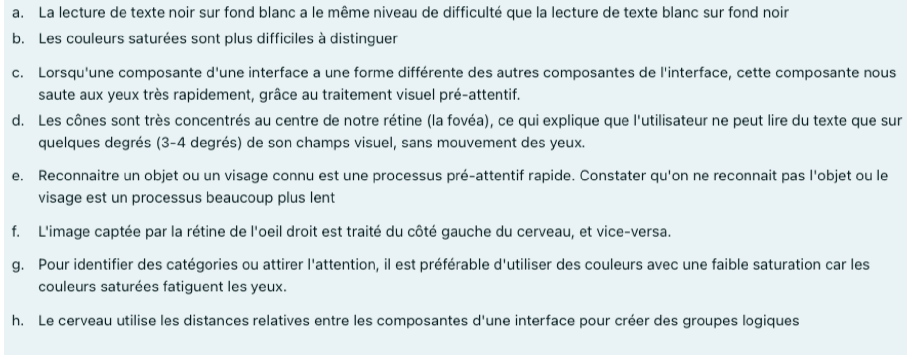

# Concepts clés de Norman (modèles conceptuels)

- Affordances
    - Visible, fonctionnement intuitif (encourage une action)
- Contraintes
    - "Sens contraire" des affordances, limitent ou découragent certaines
    actions, empêchent les erreurs, peuvent aider à suggérer comment
    utiliser (ou pas) une interface (décourage une action)
- Visibilité
    - Permet de voir comment utiliser l'objet ou l'interface &rarr; on veut que
      les affordances et le retour soient visibles (les actions sont
      visibles)
- Mapping
    - Correspondance entre les actions et leurs résultats, bon mapping &rarr;
      naturel + évident + mémorable (les actions sont faciles à se rappeler)
- Retour (feedback)
    - Indication immédiate du résultats des actions de l'utilisateur, le
      retour peut être &rarr; visuel, auditif ou tactile (l'action donne un
      feed back)
- Constance
    - Types de constances: fonctionnelle, esthétique, interne, externe (les
      mêmes actions sont utilisées sur plusieurs systèmes du même type)

# Analyse de tâches

- Liste des tâches à faire sur l'interface
- Description du domaine et contexte d'utilisation
    - Domaine: Décrit la nature de l'application et le domaine d'activité auquel il s'applique (Cheminot: inscription des étudiants)
    - Contexte d'utilisation: Décrit l'environnement et les circonstances d'utilisation (Cheminot: Java, serveurs physiques)
- Profil des utilisateurs-type (intervenants)
    - Agents, acteurs, stakeholders
    - Mettre ce qui est commun (ex: entre 26 et 45 ans et non 26 ans)
    - Identifier les caractéristiques (comme dans le lab)
- Glossaire du domaine
    - Liste de vocabulaire du domaine (termes, concepts, outils, tâches)
- Description des tâches réalisées actuellement
    - Comment on utilise l'application actuellement pour accomplir une tâche
    - Permet de déterminer comment l'utilisation de l'application s'intègrera avec l'activité des intervenants (activités d'une réceptioniste qui ne sont pas dans l'application, comment ça va affecter ces activités)
    - Fait sous forme de cas d'utilisation
    - Niveau d'abstraction suffisamment concret:
        - "remplir le formulaire au crayon" et non "donner l'information nécessaire"
    - Diagramme de séquence complémentaire
- Matrice intervenants-tâches
    - Décrire la relation des intervenants avec les tâches
        - Fréquence, temps requis, taux d'erreurs, degré de difficulté

{width=400px}

# Les principes et directives de conception

## Principes de conception
> Plus généraux, plus fondamentaux, plus vagues; s’appliquent dans plus de cas mais peuvent être moins évidents à appliquer

- Connaissez votre utilisateur
- Minimisez le besoin de mémoriser
- Optimisez les opérations
- Concevez en vue des erreurs possibles

### Principe de Shneiderman (principe conception)
- Être cohérent (consistant)
- Concevoir pour différents utilisateurs (Seek universal usability)
- Donner un retour visuel informatif
- Indiquer à l’utilisateur que la tâche est complétée "Yield closure"
- Offrir une gestion d’erreur simple
- Rendre les actions réversibles 
- Mettre l’utilisateur en contrôle (user initiates task it's not forced upon him)
- Réduire la dépendance à la mémoire court-terme

## Les directives de conception

Plus précises, plus détaillées, s’appliquent dans moins de cas mais disent plus précisément quoi faire.

Peuvent s'adapter selon le OS/environnement.

- Permettre une navigation simple
- Rendre les cibles suffisamment grandes
- Réduire le désordre
- Afficher le texte suffisament grand
- Utiliser des contrôles tactiles
- Utiliser des formulaires simples
- Tenir compte de la position du pouce
- Concevoir une expérience cohérente

## Avantages
 - Stimules des idées de conception
 - Donnent des conseils utiles
 - Servent comme liste de vérification
 - Peuvent être utilisé pour évaluer une interface

## Désavantages
- Parfois contradiction avec 2 directives
- Souvent trop vague ou trop spécifique
- Peuvent être trop nombreux

## Patron de conception

En GUI, un patron de conception est une solution récurrente à un problème commun de conception d’interface.

### Exemples

- pull to refresh (apple mail)
- feature, search and brows (search bar in website)
- clear entry point (landing page where do i go from there for "something")
- grid of equals (Netflix film browser)
- skeuomorphic (visual style)
- filmstrip (mobile like infinit scroll of feed)
- two-panel selector split view (spotify/discord)
- action panel (window start button)
- datatips (give info on hover google maps)
- forgiving format (input field autoformating as you input phone number/credit card)

# Esquissage et prototypage

{width=400px}

- Avantages d'esquisser ou prototyper en parallèle:
    - Explorer plus de possibilités et en combiner
    - Éliminer une mauvaise idée de départ
    - On accepte mieux les critiques
    - Encourage la comparaison des différentes possibilités

# KLM

Se limite aux utilisateurs (experts) et aux tâches familières.

- Déterminer les tâches élémentaires de l'interface.
	- e.g. ajouter un client, acheter un produit, etc.
- Établir les modèles KLM de chacune de ces tâches.
	- Modèle = séquence d'actions élémentaires
- Estimer les temps d'exécution $t_{i}$ de ces tâches.
- Estimer les fréquences $f_{i}$ des tâches pour un usager-type.
- Quantifier l'efficience globale
	- cummation ($f_{i} \cdot t_{i}$).

## Règles
- Homing (H) - 400ms
- Pointage (P) - 1100ms
- Keystroke (K) - 200ms
- Button press or release (B) -  100ms
- Activité mentale (M) - 1200ms
- Réponse du système (R ou W) - $max(t, 1200)$ ms
- Défilement (Scroll) - 3960ms

- Placer les M
	- Écrire séquence sans les M
	- Placer un M devant chaque P, B, K
	- Remplacer M consécutif par un M (MM&rarr;M)

# Loi de Fitts

$$\boxed{T=a+b \cdot \log_2{(D/W + 1)}}$$

- T ou MT = temps moyen de mouvement
- $D$ = distance
- $W$ = largeur cible (si 2D prend Min(x,y))
- $a$, $b$ constantes mesurées
- $IP = 1/b$ &rarr; indice de performance

La loi de Fitts modélise les mouvements réciproques ("aller retour") et discrets ("un coup") en 1D ou en 2D

# Loi de Hick-Hyman

$$\boxed{\text{Temps de réaction} = a + b \cdot \log_{2}(N+1)}$$

- N = nb de choix
- a, b des constantes mesurées de facons expérimental

Quand l'utilisateur sait ce qu'il cherche, ordre logique.

# Vision et perception

{width=450px}

a) est vrai et f) et faux

## Vision périphérique
- On centre la fovéa (partie de l'oeil) à quelque part et notre cerveau remplit le reste avec la vision périphérique et nos attentes/connaissances.
- Implications pour le GUI
	- Si on mets un message d'erreur trop loin d'où la fovea est focus, l'utilisateur peut ne pas le voir

## L'effet "pop-out" pré-attentif (ou pré-conscient)

Pendant le traîtement pré-attentif (ou pré-conscient) du champ visuel par le système visuel, le champ visuel est traîté en parallèle.

Variables: couleur, forme, taille, orientation, mouvement, espacement, lissage ou ombrage.

## Subitiser
- Limité jusqu'à 4 à 5 objets.
- Coûte 40 à 100ms par objet alors que compter coûte 250 à 300ms par objet.

## Reconnaissance vs rappel

- Reconnaissance: processus très rapide qui ne demande pas de traîtement comparatif
- Rappel: plus long et difficile, nécessite une "recherche" dans la mémoire à long-terme
- Exemples dans les interfaces:
	- Icônes = reconnaissance des formes
	- Suggestions de recherche (Spotlight) = reconnaissance
	- Rappel de username/password = reconnaissance des indices
	- Raccourcis clavier = rappel

## Distinction des couleurs

- Trois facteurs impactent grandement notre capacité à distinguer deux couleurs:
	- Pâleur (luminance élevée, saturation basse)
	- Taille de l'échantillon
	- Espacement

## Composantes HSV
- Teinte (hue): fréquence "dominante";
- Saturation: "pureté" de la teinte (ex: rouge est plus saturé que rose, gris et blanc ne sont pas saturés du tout)
- Valeur (luminance ou lumière): mesure de clarté

## Couleurs dans les GUI
- Couleurs pures (saturées):
	- Attirent l'attention
	- Peuvent communiquer de l'excitation
	- Besoin de plus de *focus* que les couleurs moins pures (désaturées)
	- Peuvent entraîner de la fatigue oculaire
- Utiliser les couleurs saturées dans le UI pour faire ressortir un élément (avertissement, erreur, etc...)

## Perceptions

- Perception de structure: l'utilisateur cherche à percevoir la structure de l'interface, surtout pour:
	- Identifier les éléments formant un groupe logique
	- Identifier les informations importantes
	- Comprendre l'ordre logique de l'interface

- Perception de Gestalt: percoit les objects comme des ensembles cohérents plutôt que des éléments individuels. Quelques principes de Gestalt:
	- Proximité
	- Similitude (continuité)
	- Sort commun (symétrie)
	- Figure / arrière plan

## Structurer l'information

### Patron en F
- Les premières lignes et les premiers mots à gauche sont toujours plus regardées que les autres
- On l'utilise quand:
	- une page n'a pas de mise en forme pour le Web (ex: mur de texte mais pas de gras, de puces ou de titres)
	- on essaie d'être le plus efficace sur cette page
	- on n'est pas assez engagé ou intéressé

- Créer une hiérarchie visuelle
- Ne jamais center un paragraphe de texte

# Modèle accrocheur

Technique de conception d'interface utilisateur pour encourager l'utilisation continue d'un produit en créant une boucle de rétroaction (feedback loop) qui incite les utilisateurs à revenir (créer une habitude).

## Trigger (élément déclencheur)

Incite l'utilisateur à intéragir avec le produit.

- **Externe**: vient de l'environnement de l'utilisateur. (ex: courriel, message texte, notifications)
- **Interne**: vient de l'utilisateur lui-même, souvent une émotion ou un besoin. (ex: ennui, solitude, recherche de valorisation)

Exemple : Un réseau social qui envoie des notifications pour signaler de nouvelles activités ou messages sur la plateforme pour inciter les utilisateurs à revenir régulièrement. 

## Action

L'action que l'utilisateur doit faire afin d'obtenir une récompense ou satisfaction qu'il anticipe.

Exemple: Cliquer sur une notification.

## Récompense

Élément qui procure une satisfaction à l'utilisateur après avoir accompli une action. Elle doit être **immédiate** et **variable** (imprévisible) pour maintenir l'intérêt de l'utilisateur.

- Trois natures:
	- Tribe (tribue): récompenses sociales basées sur la connexion et l'acceptation.
	- Hunt (chasse): recherche de ressources matérielles.
	- Self (soi): gratification personnelle sous forme de maîtrise ou de réalisation de soi.

Exemple : L'utilisateur lit le message et ressent une satisfaction sociale.

## Investissement

Encourage l'utilisateur à répéter l'action dans le futur. Cela peut inclure le temps, l'argent ou les données personnelles investis dans l'utilisation du produit ou service. Peut avoir l'effet d'entreproser de la valeur dans le produit.

Peut mener indirectement au prochain *trigger* externe (ou même interne).

Exemple :

- L'effet IKEA, le fait que le client ai construit lui-même le meuble le rend plus précieux à ses yeux.
- L'utilisateur répond au message et investit du temps et de l'énergie dans la conversation pour renforcer ses liens sociaux sur la plateforme.

# Questions du quiz

- Recommandations du système: Récompense
- La recherche de validation en est un exemple: Trigger interne
- Peut être une émotion: Trigger interne
- L'association avec un endroit physique en est un exemple: Trigger interne
- Doit être variable: Récompense
- Peut charger (load) le prochain élément déclencheur: Investissement
